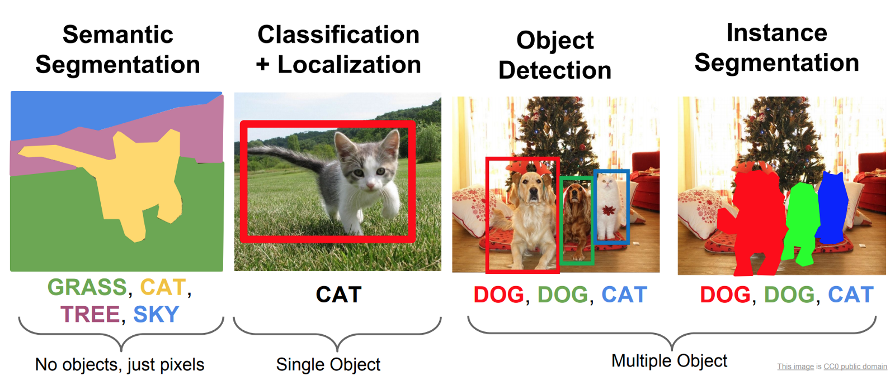
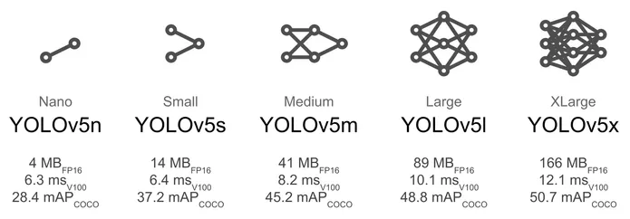
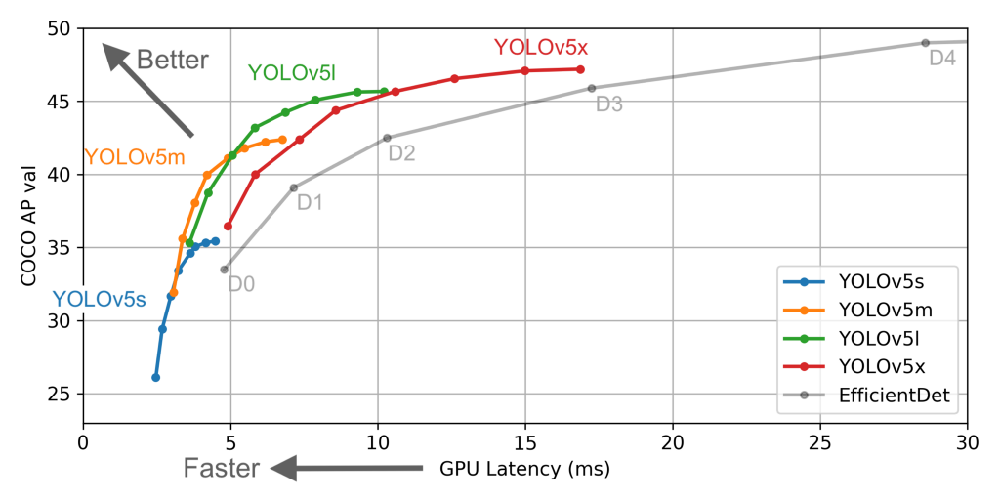
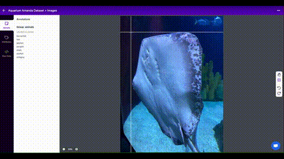
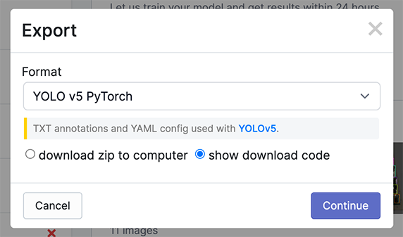
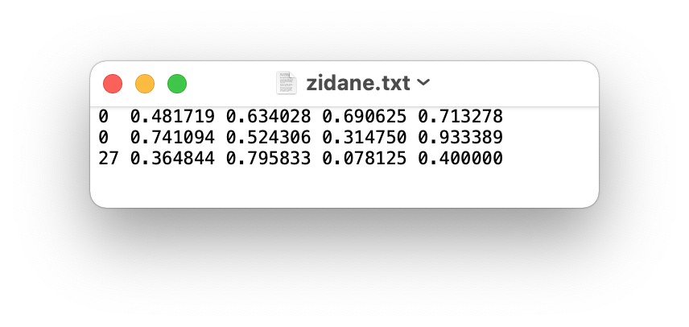
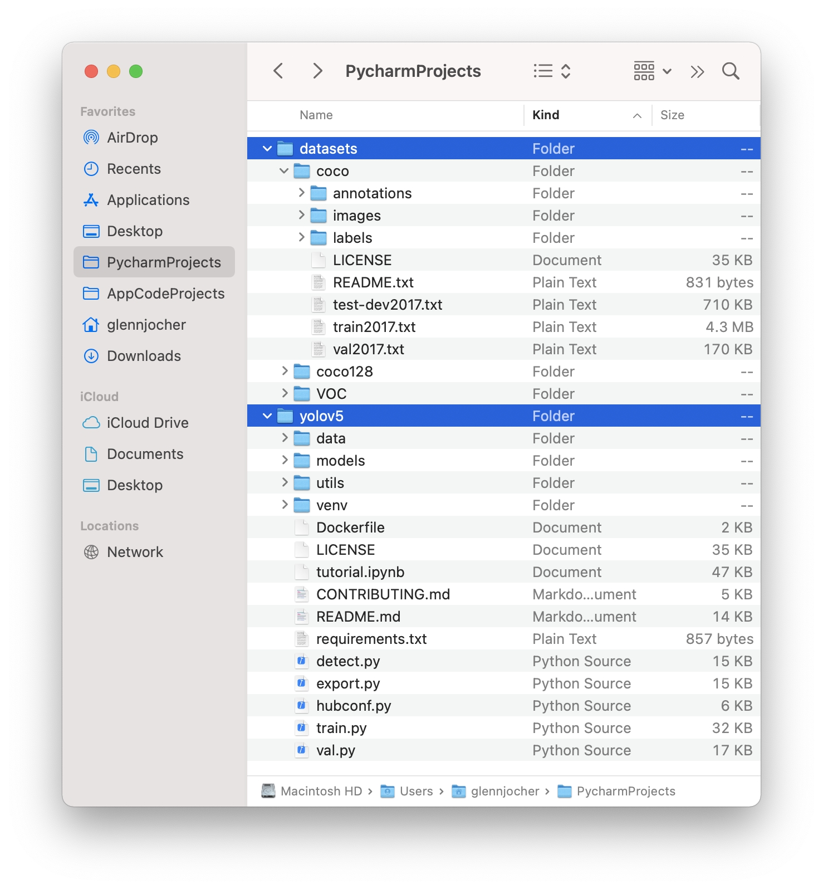

# LAB9 tutorial for Machine Learning

# Object Detection and Tracking

> The document description are designed by JIa Yanhong in 2022. Nov. 6th

## Objective

- Understanding Object Detection
- Use YOLOv5 for object detection on various images and videos
- Use YOLOv5+DeepSort for object detection and tracking
- Prepare the opening presentation of final project.

## Preface

There are a lot many interesting problems in the Image domain.


In this lab, we focus on Object Detection.

Object Detection is a Computer Vision task to detect and localize objects in images and video,   it is one of the fundamental problems of computer vision.


Object Detection is used almost everywhere these days. The use cases are endless, be it Tracking objects, Video surveillance, Pedestrian detection, Anomaly detection, People Counting, Self-driving cars or Face detection, the list goes on.

State-of-the-art object detection methods can be categorized into two main types: One-stage vs. two-stage object detectors.

- The two-stage detectors involves:

  (1) Object region proposal with conventional Computer Vision methods or deep networks, followed by

  (2) Object classification based on features extracted from the proposed region with bounding-box regression.
- One-stage detectors

  One-stage detectors predict bounding boxes over the images without the region proposal step. This process consumes less time and can therefore be used in real-time applications.

After 2014 – Two-stage object algorithms

- RCNN and SPPNet (2014)
- Fast RCNN and Faster RCNN (2015)
- Mask R-CNN (2017)
- Pyramid Networks/FPN (2017)
- G-RCNN (2021)

Most important one-stage object detection algorithms

- YOLO (2016)
- SSD (2016)
- RetinaNet (2017)
- YOLOv3 (2018)
- YOLOv4 (2020)
- YOLOv5 (2020)
- YOLOR (2021)
- YOLOv7 (2022)


<div  align="center"></div>


Two-stage methods achieve the highest detection accuracy but are typically slower. Because of the many inference steps per image, the performance (frames per second) is not as good as one-stage detectors.

One - step detector is used more often in real - time object detection in engineering applications.

In this lab, we will go through the tutorial of YOLOv5 for object detection.

We will understand what is YOLOv5 and show you how to use YOLOv5 for object detection on various images and videos.

*(But please note that the inclusion of YOLOv5 in the YOLO family is a matter of debate in the community, and neither its paper has been released officially for peer review. So its architectural and performance details mentioned here, as collected from the various sources have to be taken with a pinch of salt.)*

## **YOLOv5: Real-Time Object Detection**

### **History and Controversy**

YOLO stands for You Look Only Once and it is one of the finest family of object detection models with state-of-the-art performances.


Its first model was released in 2016 by `<big>`Joseph Redmon `</big>` who went on to publish  `<big>`YOLOv2 (2017) and YOLOv3 (2018)`</big>`. In 2020 Joseph Redmon stepped out from the project citing ethical issues in the computer vision field and his work was further improved by  `<big>`Alexey Bochkovskiy `</big>` who produced YOLOv4 in 2020.

YOLOv5 is the next controversial member of the YOLO family released in 2020 by the company `<big>`Ultranytics `</big>` just a few days after YOLOv4.

### **Where is YOLOv5 Paper?**

YOLOv5 is controversial due to the fact that no paper has been published yet (till the time of writing this) by its author Glenn Jocher for the community to peer review its benchmark. Neither it is seen to have implemented any novel techniques to claim itself as the next version of YOLO. Instead, it is considered as the PyTorch extension of YOLOv3 and a marketing strategy by Ultranytics to ride on the popularity of the YOLO family of object detection models.

But one should note that when YOLOv3 was created, Glenn Jocher (creator of YOLOv5) contributed to it by providing the implementation of mosaic data augmentation and genetic algorithm.

### **Is YOLOv5 Good or Bad?**

Certainly, the controversy behind YOLOv5 is just due to its choice of name, but it does not take away the fact that this is after all a great YOLO object detection model ported on PyTorch.

Probably if you are just a developer, you would not even care about the controversy and may enjoy working with YOLOv5 due to its ease of use. (As we will see in the examples of this tutorial)

### **YOLOv5 Architecture**

``([Source](https://www.researchgate.net/publication/349299852_A_Forest_Fire_Detection_System_Based_on_Ensemble_Learning))

The YOLO family of models consists of three main architectural blocks i) Backbone, ii) Neck and iii) Head.

1. **YOLOv5 Backbone:** It employs CSPDarknet as the backbone for feature extraction from images consisting of cross-stage partial networks.
2. **YOLOv5 Neck:** It uses PANet to generate a feature pyramids network to perform aggregation on the features and pass it to Head for prediction.
3. **YOLOv5 Head:** Layers that generate predictions from the anchor boxes for object detection.

Apart from this YOLOv5 uses the below choices for training –

1. **Activation and Optimization:** YOLOv5 uses leaky ReLU and sigmoid activation, and SGD and ADAM as optimizer options.
2. **Loss Function:** It uses Binary cross-entropy with logits loss.

### **Different Types of YOLOv5**

[YOLOv5 Model Comparison](https://pytorch.org/hub/ultralytics_yolov5/)

YOLOv5 has multiple varieties of pre-trained models as we can see above. The difference between them is the trade-off between the size of the model and inference time. The lightweight model version YOLOv5s is just 14MB but not very accurate. On the other side of the spectrum, we have YOLOv5x whose size is 168MB but is the most accurate version of its family.



## YOLOv5 Tutorial for Object Detection

In this section, we will see hands-on examples of using YOLOv5 for object detection of both images and videos.

### Cloning the YOLOv5 Repository

Clone the YOLOv5 repository made and maintained by Ultralytics.

 YOLOv5 github: https://github.com/ultralytics/yolov5.git

```
git clone https://github.com/ultralytics/yolov5.git  # clone
```

### Installing Requirements

```
cd yolov5
pip install -r requirements.txt  # install
```

### Train On Custom Data

### Create Dataset

YOLOv5 models must be trained on labelled data in order to learn classes of objects in that data. There are two options for creating your dataset before you start training:

#### Use [Roboflow](https://roboflow.com/?ref=ultralytics) to label, prepare, and host your custom data automatically in YOLO format

##### Collect Images

Your model will learn by example. Training on images similar to the ones it will see in the wild is of the utmost importance. Ideally, you will collect a wide variety of images from the same configuration (camera, angle, lighting, etc) as you will ultimately deploy your project.

If this is not possible, you can start from [a public dataset](https://universe.roboflow.com/?ref=ultralytics) to train your initial model and then [sample images from the wild during inference](https://blog.roboflow.com/computer-vision-active-learning-tips/?ref=ultralytics) to improve your dataset and model iteratively.

##### Create Labels

Once you have collected images, you will need to annotate the objects of interest to create a ground truth for your model to learn from.



[Roboflow Annotate](https://roboflow.com/annotate?ref=ultralytics) is a simple web-based tool for managing and labeling your images with your team and exporting them in [YOLOv5&#39;s annotation format](https://roboflow.com/formats/yolov5-pytorch-txt?ref=ultralytics).

##### Prepare Dataset for YOLOv5

###### Prepare, Export, and Host Your Dataset with Roboflow

Whether you [label your images with Roboflow](https://roboflow.com/annotate?ref=ultralytics) or not, you can use it to convert your dataset into YOLO format, create a YOLOv5 YAML configuration file, and host it for importing into your training script.

[Create a free Roboflow account](https://app.roboflow.com/?model=yolov5&ref=ultralytics) and upload your dataset to a `Public` workspace, label any unannotated images, then generate and export a version of your dataset in `YOLOv5 Pytorch` format.

Note: YOLOv5 does online augmentation during training, so we do not recommend applying any augmentation steps in Roboflow for training with YOLOv5. But we recommend applying the following preprocessing steps:


- **Auto-Orient** - to strip EXIF orientation from your images.
- **Resize (Stretch)** - to the square input size of your model (640x640 is the YOLOv5 default).

Generating a version will give you a point in time snapshot of your dataset so you can always go back and compare your future model training runs against it, even if you add more images or change its configuration later.



Export in `YOLOv5 Pytorch` format, then copy the snippet into your training script or notebook to download your dataset.


Now continue with `2. Select a Model`.

#### Or manually prepare your dataset

##### Create dataset.yaml

[COCO128](https://www.kaggle.com/ultralytics/coco128) is an example small tutorial dataset composed of the first 128 images in [COCO](http://cocodataset.org/#home) train2017. These same 128 images are used for both training and validation to verify our training pipeline is capable of overfitting. [data/coco128.yaml](https://github.com/ultralytics/yolov5/blob/master/data/coco128.yaml), shown below, is the dataset config file that defines 1) the dataset root directory `path` and relative paths to `train` / `val` / `test` image directories (or *.txt files with image paths) and 2) a class `names` dictionary:

```
# Train/val/test sets as 1) dir: path/to/imgs, 2) file: path/to/imgs.txt, or 3) list: [path/to/imgs1, path/to/imgs2, ..]
path: ../datasets/coco128  # dataset root dir
train: images/train2017  # train images (relative to 'path') 128 images
val: images/train2017  # val images (relative to 'path') 128 images
test:  # test images (optional)

# Classes (80 COCO classes)
names:
  0: person
  1: bicycle
  2: car
  ...
  77: teddy bear
  78: hair drier
  79: toothbrush
```

##### Create Labels

After using a tool like [Roboflow Annotate](https://roboflow.com/annotate?ref=ultralytics) to label your images, export your labels to **YOLO format**, with one `*.txt` file per image (if no objects in image, no `*.txt` file is required). The `*.txt` file specifications are:

- One row per object
- Each row is `class x_center y_center width height` format.
- Box coordinates must be in **normalized xywh** format (from 0 - 1). If your boxes are in pixels, divide `x_center` and `width` by image width, and `y_center` and `height` by image height.
- Class numbers are zero-indexed (start from 0).


The label file corresponding to the above image contains 2 persons (class `0`) and a tie (class `27`):



##### Organize Directories

Organize your train and val images and labels according to the example below. YOLOv5 assumes `/coco128` is inside a `/datasets` directory **next to** the `/yolov5` directory. **YOLOv5 locates labels automatically for each image** by replacing the last instance of `/images/` in each image path with `/labels/`. For example:

```
../datasets/coco128/images/im0.jpg  # image
../datasets/coco128/labels/im0.txt  # label
```



Here we download a [mask  wearing dataset](https://public.roboflow.com/object-detection/mask-wearing) directly from roboflow's public dataset.


### Select a Model

Select a pretrained model to start training from. Here we select [YOLOv5s](https://github.com/ultralytics/yolov5/blob/master/models/yolov5s.yaml), the second-smallest and fastest model available. See our README [table](https://github.com/ultralytics/yolov5#pretrained-checkpoints) for a full comparison of all models.


### Train

Train a YOLOv5s model on `mask  wearing dataset` by specifying dataset, batch-size, image size and either pretrained `--weights best.pt` , or randomly initialized `--weights '' --cfg yolov5s.yaml` . Pretrained weights are auto-downloaded from the [latest YOLOv5 release](https://github.com/ultralytics/yolov5/releases).

```
# Train YOLOv5s on mask wearing dataset for 3 epochs
$ python train.py --img 640 --batch 16 --epochs 30 --data D:/yolo/datasets/MaskDataSet/data.yaml --weights '' --cfg yolov5s.yaml

```

```
$ python train.py --img 640 --batch 16 --epochs 30 --data D:/yolo/datasets/MaskDataSet/data.yaml --weights runs\train\exp11\weights\best.pt
```

All training results are saved to `runs/train/` with incrementing run directories, i.e. `runs/train/exp2`, `runs/train/exp3` etc

### Visualize （Local Logging）

Training results are automatically logged with [Tensorboard](https://www.tensorflow.org/tensorboard) and [CSV](https://github.com/ultralytics/yolov5/pull/4148) loggers to `runs/train`, with a new experiment directory created for each new training as `runs/train/exp2`, `runs/train/exp3`, etc.

This directory contains train and val statistics, mosaics, labels, predictions and augmentated mosaics, as well as metrics and charts including precision-recall (PR) curves and confusion matrices.


Results file `results.csv` is updated after each epoch, and then plotted as `results.png` (below) after training completes. You can also plot any `results.csv` file manually:

```
from utils.plots import plot_results
plot_results('path/to/results.csv')  # plot 'results.csv' as 'results.png'
```


Once your model is trained you can use your best checkpoint `best.pt` to:

- Run  [Python](https://github.com/ultralytics/yolov5/issues/36) inference on new images and videos
- [Validate](https://github.com/ultralytics/yolov5/blob/master/val.py) accuracy on train, val and test splits

### validation with val.py

Validate a trained YOLOv5 detection model on a detection dataset

```
  $ python val.py --weights runs\train\exp11\weights\best.pt --data D:/yolo/datasets/MaskDataSet/data.yaml --img 640
```

### Inference with detect.py

Run YOLOv5 detection inference on images, videos, directories, globs, YouTube, webcam, streams, etc.

`detect.py` runs inference on a variety of sources, downloading [models](https://github.com/ultralytics/yolov5/tree/master/models) automatically from the latest YOLOv5 [release](https://github.com/ultralytics/yolov5/releases) and saving results to `runs/detect`.

```

$ python detect.py --weights runs\train\exp11\weights\best.pt --source  0                               # webcam
                                                                        img.jpg                         # image
                                                                        vid.mp4                         # video
                                                                        path/                           # directory
                                                                        'path/*.jpg'                    # glob
                                                                        'https://youtu.be/Zgi9g1ksQHc'  # YouTube
                                                                        'rtsp://example.com/media.mp4'  #RTSP, RTMP, HTTP stream
```

## Yolov5 + Deep Sort Tutorial for Object Detection and Tracking

## Introduction

This repository contains a two-stage-tracker. The detections generated by [YOLOv5](https://github.com/ultralytics/yolov5), a family of object detection architectures and models pretrained on the COCO dataset, are passed to a [Deep Sort algorithm](https://github.com/ZQPei/deep_sort_pytorch) which tracks the objects. It can track any object that your Yolov5 model was trained to detect.


## Before running the tracker

### Cloning the YOLOv5-Deepsort Repository

yolov5-deepsort github: https://github.com/HowieMa/DeepSORT_YOLOv5_Pytorch

```
git clone https://github.com/HowieMa/DeepSORT_YOLOv5_Pytorch.git  # clone
```

Make sure that you fulfill all the requirements: Python 3.8 or later with all [requirements.txt](https://github.com/mikel-brostrom/Yolov5_DeepSort_Pytorch/blob/master/requirements.txt) dependencies installed, including torch>=1.7. To install, run:

```
pip install -r requirements.txt
```

Download the yolov5 weight. I already put the `yolov5s.pt` inside. If you need other models, please go to [official site of yolov5](https://github.com/ultralytics/yolov5). and place the downlaoded `.pt` file under `yolov5/weights/`.
And I also aready downloaded the deepsort weights. You can also download it from [here](https://drive.google.com/drive/folders/1xhG0kRH1EX5B9_Iz8gQJb7UNnn_riXi6), and place `ckpt.t7` file under `deep_sort/deep/checkpoint/`

## Running tracker

```
# on video file
python main.py --input_path [VIDEO_FILE_NAME] --display

# on webcam 
python main.py --cam 0 --display
```

## Other Tutorials

* [Yolov5 training on Custom Data (link to external repository)](https://github.com/ultralytics/yolov5/wiki/Train-Custom-Data)&nbsp;
* [DeepSort deep descriptor training (link to external repository)](https://kaiyangzhou.github.io/deep-person-reid/user_guide.html)&nbsp;
* [Yolov5 deep_sort pytorch evaluation](https://github.com/mikel-brostrom/Yolov5_DeepSort_Pytorch/wiki/Evaluation)
* [Yolov5_DeepSort_Pytorch](https://github.com/mikel-brostrom/Yolov5_DeepSort_Pytorch)
* [yolov5](https://github.com/ultralytics/yolov5)
* [deep_sort_pytorch](https://github.com/ZQPei/deep_sort_pytorch)
* [deep_sort](https://github.com/nwojke/deep_sort)

## Reference

[1] Joseph Redmon, et al. “You only look once: Unified, real-time object detection.” CVPR 2016.

[2] Joseph Redmon and Ali Farhadi. “YOLO9000: Better, Faster, Stronger.” CVPR 2017.

[3] Joseph Redmon, Ali Farhadi. “YOLOv3: An incremental improvement.”.

[4] Lilian Weng. Object Detection Part 4: Fast Detection Models Dec 27, 2018
